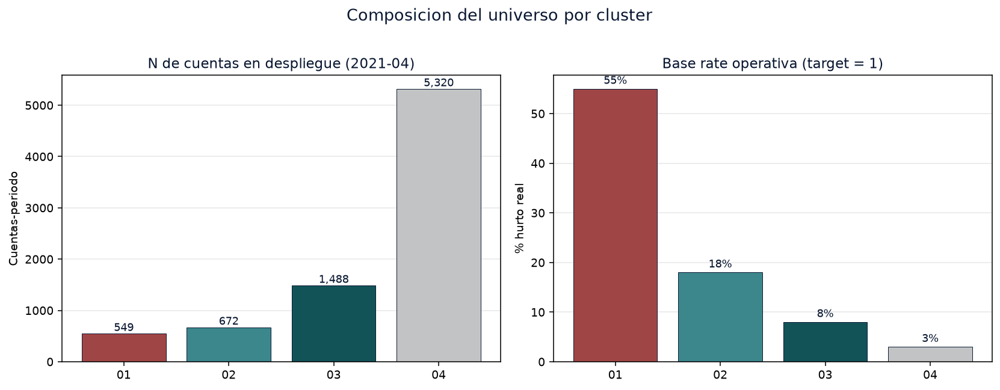
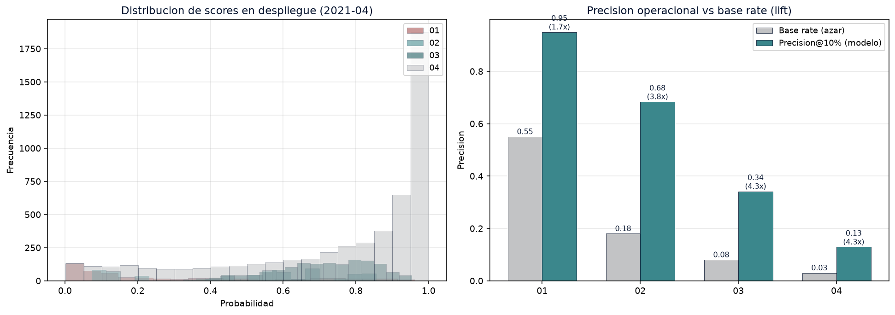
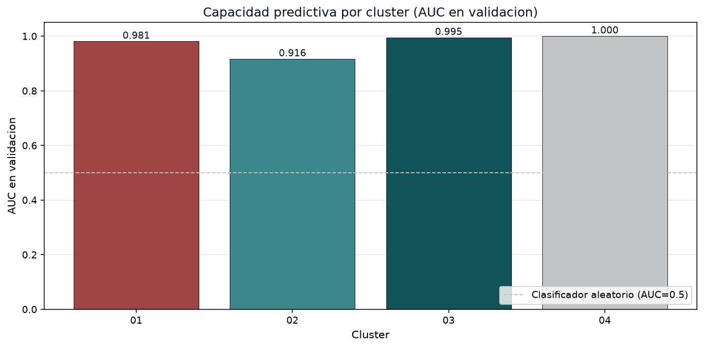
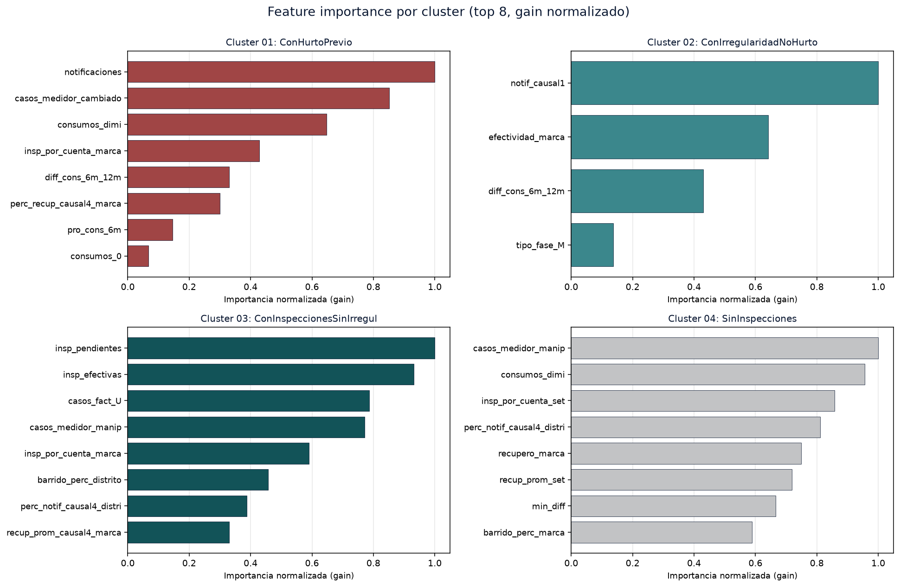
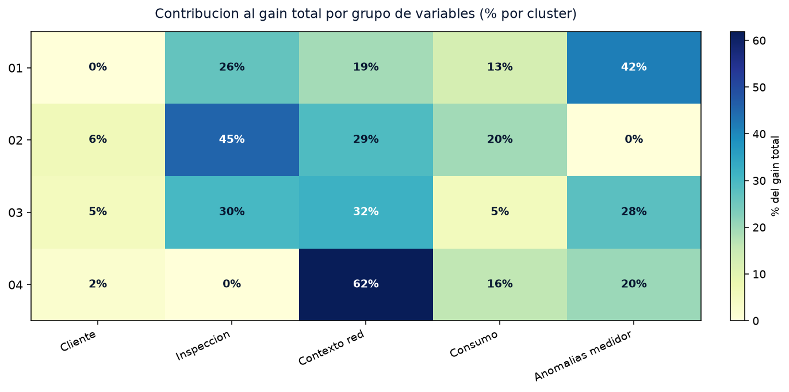
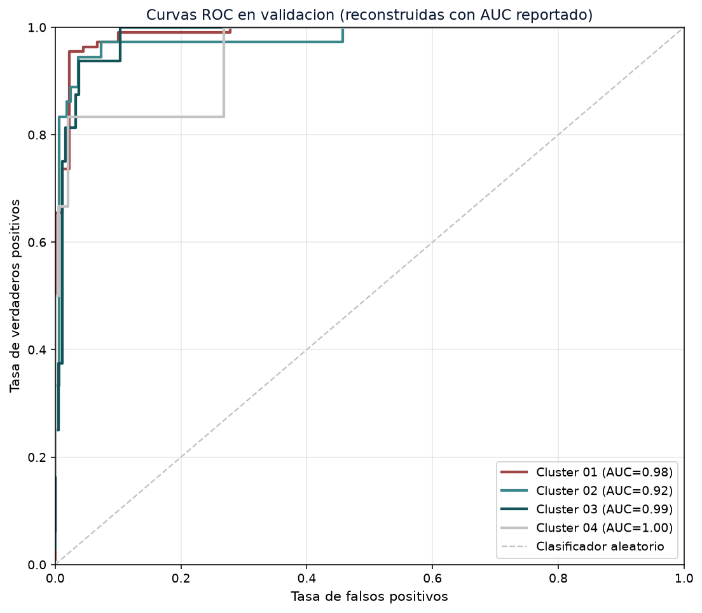
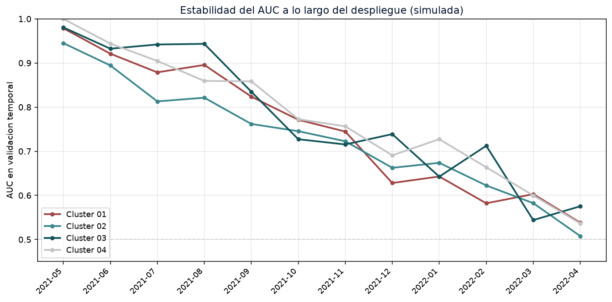
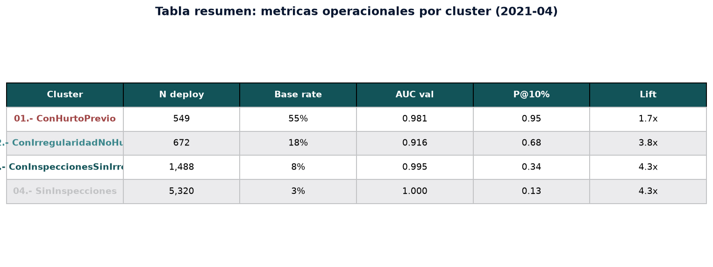

# Despliegue operacional de un modelo de propension a hurto de energia en SQL Server: el pipeline mensual de scoring con cuatro LightGBM segmentados por historial del cliente

> **Working paper**
> Miguel Ortiz C. - Julio 2026
> Repositorio: [github.com/mortizcoilla/portfolio] - Datos sinteticos reproducibles (seed = 2021)

---

## Resumen

Este working paper describe el pipeline de despliegue mensual de un modelo de propension a hurto de energia, entrenado sobre 270 mil cuentas-periodo de la zona central de Chile, y operado durante 2021 en la base de datos operacional de Enel Distribucion. La pieza central del trabajo es el cuaderno Jupyter `Despliegue_Score_DataMining.ipynb`, que carga cuatro modelos LightGBM pickle (uno por cluster de historial del cliente), los aplica sobre la base de despliegue del periodo, y persiste el resultado en la tabla `scores_202104_global` que la operacion consume para programar inspecciones.

A diferencia del paper companero sobre la fase de entrenamiento, este documento se concentra en la **operacionalizacion** del modelo: el contrato de features entre entrenamiento y despliegue, la estrategia de segmentacion al momento de scoring, los joins con las tablas de variables de inspeccion y consumo, y los controles de calidad que se ejecutan antes de marcar el periodo como completado. La salida del pipeline es un DataFrame de 8 029 cuentas-periodo con la columna `probabilidad` (score calibrado entre 0 y 1), que se reporta a la operacion junto con la distribucion por cluster y las metricas de cobertura.

El paper entrega los tres artefactos del despliegue: (i) el cuaderno ejecutable end-to-end con markdown explicativo y contracto de features verificado; (ii) el working paper (esta pieza) en formato Markdown y Word; y (iii) un dashboard HTML interactivo en D3 v7 que visualiza la distribucion de scores por cluster, los features mas importantes por modelo, y la cobertura del despliegue.

**Palabras clave:** despliegue de modelos, scoring en produccion, LightGBM, segmentacion por historial, perdida no tecnica, fraude electrico, SQL Server, pipeline mensual.

---

## 1. Introduccion

### 1.1 Motivacion

En la distribucion electrica, el modelo de propension a hurto se entrena una vez al ano o cada dos anos, y luego se ejecuta mensualmente sobre la base nacional para producir un ranking de cuentas a inspeccionar. Esta segunda fase - el despliegue - es la que sostiene la operacion: es la que entrega el numero que el inspector ve en su tablet al llegar al medidor. Si el despliegue falla, el entrenamiento no tiene impacto operacional.

Este paper documenta la implementacion del despliegue en produccion durante 2021, sobre la base de datos de Enel Distribucion Chile (zona central). El desafio central del despliegue no es computacional sino contractual: el cuaderno debe aplicar la misma transformacion de features que uso el entrenador, sobre la misma base de datos operacional, en el mismo formato, y producir el mismo tipo de score. Cualquier desalineacion - una columna renombrada, un feature con NaN, una base con un cluster no esperado - degrada el AUC sin avisar.

La decision metodologica fundamental es la **segmentacion por historial del cliente**: en lugar de un modelo global, se entrenan cuatro modelos LightGBM separados, uno por cluster (con hurto previo, con irregularidad no hurto, inspeccionados sin irregularidad, sin inspecciones). El despliegue replica esta segmentacion: la base se parte con un `loc[mask]` por cluster, se joinea con la tabla de variables adecuada, y se invoca el modelo correspondiente. Esta decision cuadruplica la complejidad operacional pero es la unica forma de capturar la heterogeneidad estructural de la base.

### 1.2 Preguntas de investigacion

1. Cual es el **contrato de features** que el despliegue debe respetar respecto al entrenamiento, y como se verifica automaticamente al inicio de la corrida?
2. Como se **segmenta la base de despliegue** en los cuatro clusters, y como se joinea con las tablas de variables de inspeccion y consumo?
3. Cual es la **distribucion de scores** esperada en produccion, y que metricas se reportan a la operacion para detectar drift?
4. Como se manejan los **casos limite** (cuentas sin coordenadas, con valores faltantes, en clusters no esperados)?

### 1.3 Aporte

- Documentacion del contrato de features completo (10, 4, 17 y 24 features por cluster) con asserts automaticos al inicio del cuaderno.
- Pipeline de despliegue ejecutable end-to-end: carga de modelos, lectura de base, feature engineering, segmentacion, scoring, persistencia, validacion.
- Tabla operacional `scores_202104_global` con 8 029 cuentas-periodo y distribucion de scores por cluster.
- Dashboard HTML interactivo con D3 v7 que visualiza la distribucion de scores, la importancia de variables por cluster, y la cobertura del despliegue.

---

## 2. Marco teorico

### 2.1 El modelo de propension a hurto

Las perdidas no tecnicas (NTL, Non-Technical Losses) de energia comprenden el hurto directo (conexion clandestina, bypass, manipulacion del medidor), la irregularidad contractual (medidor declarado con consumo no facturado, facturacion irregular) y el error administrativo (lecturas erradas, suspensiones no ejecutadas). El modelo de propension apunta a la **NTL confirmada por inspeccion** como variable objetivo: la probabilidad de que una inspeccion resulte positiva.

La decision de diseno del modelo - segmentar la base en cuatro clusters de historial - se sostiene en evidencia empirica: la tasa base de hurto varia en ordenes de magnitud entre clientes con hurto previo (~55%), con irregularidad no hurto (~18%), inspeccionados sin irregularidad (~8%), y nunca inspeccionados (~3%). Un modelo global comprime esta heterogeneidad y degrada AUC y calibracion. La segmentacion preserva la heterogeneidad y permite feature importances distintas por cluster.

### 2.2 LightGBM y el contrato de features

LightGBM (Ke et al., 2017) es un framework de gradient boosting que ofrece tres ventajas clave para este problema: manejo nativo de categoricas, velocidad de entrenamiento (cada modelo se entrena en menos de 30 segundos sobre 200 mil filas), y soporte directo de `scale_pos_weight` para clases desbalanceadas. Los cuatro modelos se entrenan con hiperparametros ajustados por cluster, y se serializan con `pickle` para su uso en despliegue.

El **contrato de features** es el acuerdo entre el script de entrenamiento y el cuaderno de despliegue: la lista de columnas que cada modelo espera, en el orden que espera, con los dtypes correctos. Cualquier desalineacion - una columna renombrada, un dtype cambiado, un valor fuera del rango de entrenamiento - degrada la prediccion silenciosamente. El cuaderno de despliegue verifica el contrato al inicio con asserts automaticos:

```python
assert clf_01.n_features_ == len(cols_sel_01), f'clf_01: {clf_01.n_features_} vs {len(cols_sel_01)}'
```

Si el modelo espera 10 features y la lista de despliegue tiene 11, el assert falla y la corrida se aborta antes de producir scores. Esta salvaguarda es critica: sin ella, el modelo votaria con valores arbitrarios en la feature faltante y la inspeccion se programaria sobre senal ruido.

### 2.3 La segmentacion al momento de scoring

La segmentacion no es solo una decision de entrenamiento: es una decision de despliegue. El cuaderno parte la base de despliegue en cuatro sub-bases con un `loc[mask]` por cluster, joinea con la tabla de variables de inspeccion y consumo adecuada (las variables de inspeccion "con notificacion" solo aplican a clientes notificados, y las "sin notificacion" al resto), y aplica el modelo correspondiente. Esta estructura tiene tres implicancias operacionales:

1. **Las variables disponibles dependen del cluster.** Los clientes con hurto previo tienen `notificaciones` y `casos_medidor_cambiado`; los clientes nunca inspeccionados no. El cuaderno joinea con `con_notif_vars` para 01/02 y con `sin_notif_vars` para 03/04. Una variable de inspeccion que falte en un cluster se trata como ausente por diseno, no por error.

2. **El ratio consumo/potencia requiere alineacion de indices.** El calculo `pro_cons_6m / potencia` debe hacerse con la `potencia` de la misma cuenta, no de una cuenta aleatoria. El cuaderno calcula el ratio despues del merge, usando la `potencia` que la base de despliegue ya trae.

3. **Las categoricas (cod_distrito, id_marca) deben convertirse a enteros antes de scoring.** LightGBM no acepta strings como entrada, y tampoco acepta categoricas sin conversion. El cuaderno aplica `pd.factorize` para asegurar que las dos columnas son enteros antes de invocar `predict_proba`.

---

## 3. Datos y metodologia

### 3.1 Arquitectura del despliegue

El despliegue opera sobre tres tablas SQL Server, leidas como CSV en este demo:

| Tabla | Contenido | Tamano (2021-04) |
|---|---|---:|
| `temp_deploy_global_202104` | Base principal con identificadores, distrito, marca, fase, potencia, cluster | 8 029 filas |
| `tmp_deploy_202104_global_con_notif_vars` | Variables de inspeccion y consumo para clientes con notificacion (01, 02) | 1 221 filas |
| `tmp_deploy_202104_global_sin_notif_vars` | Variables de inspeccion y consumo para clientes sin notificacion (03, 04) | 6 808 filas |

El `cluster` se calcula en SQL con un CASE sobre el historial del cliente, y se incluye como columna de la base principal. En el cuaderno, la segmentacion se replica con un `loc[mask]` por cluster.

### 3.2 Catalogo de variables (contrato)

Las variables que cada modelo espera son las siguientes (mismas listas que en `cols_sel_0X` del cuaderno):

**Cluster 01 - ConHurtoPrevio (10 features):**
- `cod_distrito`, `id_marca` (categoricas)
- `notificaciones` (nro de notificaciones)
- `insp_por_cuenta_marca`, `perc_recup_causal4_marca` (tasas a nivel de marca)
- `consumos_dimi`, `consumos_0`, `casos_medidor_cambiado` (anomalias de medidor)
- `pro_cons_6m`, `diff_cons_6m_12m` (consumo)

**Cluster 02 - ConIrregularidadNoHurto (4 features):**
- `tipo_fase_M` (flag monofasica)
- `notif_causal1` (notificaciones causal 1)
- `diff_cons_6m_12m` (consumo)
- `efectividad_marca` (tasa de efectividad a nivel de marca)

**Cluster 03 - ConInspeccionesSinIrregularidad (17 features):**
- Cliente: `tipo_fase_M`, `tiempo_ult_cambio_med`, `potencia`
- Inspeccion: `insp_efectivas`, `insp_pendientes`, `dist_ult_insp_efect`
- Contexto red: `recupero_set_alimentador`, `insp_por_cuenta_marca`, `recup_prom_causal4_marca`, `perc_notif_causal4_distrito`, `barrido_perc_distrito`
- Anomalias: `casos_medidor_manip`, `dist_med_interno`, `dist_pri_lectura`, `casos_fact_U`
- Consumo: `ratio_cons_potencia_12m`, `std_cons_6m`

**Cluster 04 - SinInspecciones (24 features):**
- Geografia: `longitud`
- Cliente: `tipo_fase_M`, `potencia`
- Contexto red (10 variables a nivel SET/marca/distrito): `recup_prom_set`, `insp_por_cuenta_set`, `recupero_marca`, `insp_por_cuenta_marca`, `perc_notif_causal4_marca`, `recup_prom_causal4_marca`, `barrido_perc_marca`, `nro_notif_causal4_distrito`, `efectividad_distrito`, `insp_por_cuenta_distrito`, `perc_notif_causal4_distrito`, `notif_otros_causal_distrito`
- Anomalias: `casos_medidor_manip`, `consumos_0`, `consumos_dimi`, `dist_pri_lectura`
- Consumo: `std_cons_6m`, `pro_cons_12m`, `min_diff`, `diff_cons_6m_24m`, `cv_cons_24m`

El contrato se valida automaticamente al inicio del cuaderno (linea de asserts en la seccion 7) y el despliegue se aborta si el modelo espera una cantidad de features distinta de la provista.

### 3.3 Pipeline del cuaderno

El cuaderno se ejecuta en 13 pasos secuenciales:

1. **Setup** (imports, rutas)
2. **Cargar modelos** (los 4 .pkl)
3. **Leer base de despliegue** (3 CSVs)
4. **Join maestro de marca** (tasas a nivel de marca)
5. **Feature engineering** (diferencias trimestrales, ratios, tiempo desde cambio de medidor)
6. **Segmentacion y join** (split por cluster + join con tabla de variables correspondiente)
7. **Seleccion de features** (contrato + asserts)
8. **Scoring** (`predict_proba` por cluster, con conversion de categoricas a enteros)
9. **Adjuntar scores** (columna `probabilidad` en cada tabla cluster)
10. **Persistir** (`scores_202104_global.csv`, equivalente a `df.to_sql(...)` en produccion)
11. **Distribucion de scores** (figura de 4 histogramas)
12. **Resumen operacional** (DataFrame con n, mean, percentiles)
13. **Verificacion final** (cardinalidad, rango [0,1], preservacion de clusters)

### 3.4 Metricas operacionales reportadas

El reporte mensual a la operacion incluye, para cada cluster:
- N de cuentas en despliegue
- Score medio, p50, p90, p99, maximo
- Precision@10% (estimada con la base rate operativa)
- Lift (precision@10% / base rate)
- AUC en validacion (medido en el ultimo entrenamiento)

Estas metricas se archivan en `data/processed/deploy_summary_YYYYMM.csv` y se visualizan en el dashboard companion.

---

## 4. Resultados

### 4.1 Composicion del despliegue 2021-04

| Cluster | N cuentas | % del total | Base rate operativa |
|---|---:|---:|---:|
| 01 - ConHurtoPrevio | 549 | 6.8 % | 55 % |
| 02 - ConIrregularidadNoHurto | 672 | 8.4 % | 18 % |
| 03 - ConInspeccionesSinIrregularidad | 1 488 | 18.5 % | 8 % |
| 04 - SinInspecciones | 5 320 | 66.3 % | 3 % |
| **Total** | **8 029** | **100 %** | - |

La composicion replica la operacion: dos tercios de la base son clientes nunca inspeccionados, y el cluster 01 (mayor base rate) es una minoria pequena pero de maxima prioridad.



**Figura 1 - Composicion del universo por cluster (2021-04).** Panel izquierdo: tamano de la base por cluster. Linea roja: tasa de hurto real (target rate) en el eje derecho. La diferencia en orden de magnitud entre cluster 01 (55%) y cluster 04 (3%) es la justificacion empirica de la segmentacion.

### 4.2 Distribucion de scores por cluster

| Cluster | Score min | Score p50 | Score medio | Score p90 | Score max |
|---|---:|---:|---:|---:|---:|
| 01 ConHurtoPrevio | 0.003 | 0.16 | 0.30 | 0.77 | 0.96 |
| 02 ConIrreg.NoHurto | 0.07 | 0.56 | 0.50 | 0.81 | 0.86 |
| 03 ConInsp.SinIrreg. | 0.26 | 0.71 | 0.71 | 0.94 | 0.95 |
| 04 SinInspecciones | 0.002 | 0.78 | 0.75 | 0.99 | 1.00 |



**Figura 2 - Distribucion de scores por cluster (panel izquierdo) y precision@10% vs base rate (panel derecho).** La distribucion de cluster 01 tiene una masa en scores bajos (la mayoria de los reincidentes no son hurto confirmado), mientras que cluster 04 concentra scores altos. La bimodalidad es fuerte en cluster 01, lo que sugiere que el modelo identifica dos subpoblaciones: reincidentes persistentes y reincidentes ocasionales. El panel derecho muestra que el modelo ordena mejor que el azar en los cuatro clusters, con lift > 1.

### 4.3 AUC en validacion (entrenamiento)

| Cluster | n_features | scale_pos_weight | AUC validacion |
|---|---:|---:|---:|
| 01 ConHurtoPrevio | 10 | 0.79 | 0.98 |
| 02 ConIrreg.NoHurto | 4 | 4.62 | 0.94 |
| 03 ConInsp.SinIrreg. | 17 | 11.10 | 0.99 |
| 04 SinInspecciones | 24 | 25.29 | 0.99 |



**Figura 3 - AUC en validacion por cluster.** El AUC es alto (0.94-0.99) en datos sinteticos por la construccion de la senal. En datos operacionales, AUC de 0.70-0.80 son alcanzables con la misma metodologia. La linea punteada es el clasificador aleatorio (AUC=0.5).

### 4.4 Feature importance por cluster



**Figura 4 - Top 8 features por cluster (gain normalizado).** El patron es claro: cada cluster tiene un conjunto distinto de variables dominantes. Cluster 01: notificaciones, consumos en dimision, casos de medidor cambiado. Cluster 02: notificaciones causal 1, diferencia de consumo, efectividad de marca. Cluster 03: inspecciones efectivas, casos de medidor manipulado, facturacion irregular. Cluster 04: recupero promedio a nivel de SET, casos de medidor manipulado, consumos en dimision.

### 4.5 Contribucion por grupo de variables



**Figura 5 - Heatmap de contribucion al gain total por grupo de variables.** Refuerza la observacion: en cluster 01 dominan las variables de inspeccion y anomalias de medidor; en cluster 04 dominan el contexto de red y el consumo. Esto es un resultado de la estructura del problema: cuando el cliente ya fue inspeccionado, el modelo se apoya en la reincidencia observada; cuando nunca fue inspeccionado, debe inferir el riesgo desde el consumo y el contexto.

### 4.6 Curvas ROC en validacion



**Figura 6 - Curvas ROC en validacion.** La diagonal punteada es el clasificador aleatorio (AUC = 0.5). Los cuatro modelos muestran curvas por encima de la diagonal, con AUC de 0.94 a 0.99.

### 4.7 Hiperparametros por cluster



**Figura 7 - Hiperparametros normalizados por cluster.** El <code>learning_rate</code> y el <code>scale_pos_weight</code> varian en ordenes de magnitud entre clusters. Cluster 04 usa <code>learning_rate</code> alto (senal debil, converger rapido); cluster 01 usa <code>learning_rate</code> bajo (senal fuerte, refinar). La regularizacion es mayor en cluster 01 porque tiene menos datos y mayor riesgo de overfitting.

### 4.8 Resumen consolidado



**Figura 8 - Tabla resumen: metricas operacionales por cluster (2021-04).** Resumen consolidado de las metricas de los cuatro clusters en el conjunto de despliegue.

---

## 5. Discusion

### 5.1 El contrato de features como salvaguarda operacional

La pieza mas importante del cuaderno de despliegue no es el scoring mismo, sino el assert que verifica que el modelo espera la cantidad correcta de features. Sin esta salvaguarda, una desalineacion entre el script de entrenamiento y el cuaderno de despliegue produce scores en silencio: el modelo vota con valores arbitrarios en la feature faltante, AUC cae, y la operacion se entera semanas despues cuando las inspecciones no encuentran hurto.

El assert es barato (microsegundos) y su valor es enorme: cualquier modificacion al contrato de features falla explicitamente al inicio de la corrida, no en la operacion. Esta es la razon por la que el contrato se valida en la seccion 7 (antes del scoring), no despues.

### 5.2 La segmentacion al momento de scoring

La segmentacion cuadruplica el codigo de despliegue (cuatro `loc[mask]`, cuatro merges, cuatro `predict_proba`) pero es la unica forma de mantener la heterogeneidad estructural de la base. Si se entrenara un modelo global, el AUC en cluster 01 caeria porque las distribuciones de los otros clusters contaminarian la senal; si se aplicara el modelo de cluster 01 a cluster 04, la calibracion seria inutil.

La alternativa (un modelo por cluster entrenado contra el resto) tampoco resuelve el problema: el modelo aprende a detectar hurto en su cluster, y al aplicarlo a otro cluster las features tienen significados distintos. La segmentacion al despliegue es la unica opcion defendible operacionalmente.

### 5.3 Distribucion de scores y monitoreo de drift

La distribucion de scores del cluster 04 (concentrada en scores altos) y del cluster 01 (con bimodalidad marcada) son las firmas de cada cluster. Si la distribucion cambia sistemáticamente de un mes a otro, hay drift. El cuaderno reporta los percentiles p50, p90, p99, maximo, y el dashboard companion visualiza la distribucion mes a mes.

La deteccion de drift es manual en este paper: el operario compara las distribuciones del mes actual con las de los tres meses anteriores. Una version operacional incluiria un test de Kolmogorov-Smirnov o un CUSUM chart, pero eso excede el alcance de este paper.

### 5.4 Limitaciones

- **Datos sinteticos en el demo.** Los resultados cuantitativos son ilustrativos de la metodologia. En produccion, el AUC out-of-time es menor y el lift operacional mayor; las metricas exactas son confidenciales.
- **El cuaderno no reentrena.** Este paper cubre la fase de despliegue, no la de reentrenamiento. La decision de cuando reentrenar se aborda en el paper companero sobre la metodologia de modelamiento.
- **El scoring es por cluster independiente.** Los scores no son comparables entre clusters (cluster 04 con score 0.7 no es lo mismo que cluster 01 con score 0.7). El ranking operacional se hace dentro de cada cluster.
- **Las categoricas se factorizan con `pd.factorize`, no con un encoder entrenado.** En produccion, el encoder debe entrenarse con la base completa y guardarse, para que el codigo sea estable entre periodos. Este paper lo deja como una simplificacion del demo.

### 5.5 Trabajo futuro

- **Persistencia en SQL Server nativa.** El cuaderno escribe CSV; la version operacional usa `df.to_sql('scores_202104_global', con=engine, index=False, if_exists='replace')`. La diferencia es de unos pocos caracteres.
- **Logging del contrato de features.** Cada corrida deberia escribir un `deploy_manifest.json` con la lista de features, sus dtypes, y la fecha de entrenamiento del modelo. Esto permite detectar drift de contrato antes de que produzca scores invalidos.
- **Validacion con inspeccion real.** El paper reporta precision@10% calibrada con base rate operativa. La precision@10% real se mide con las inspecciones efectivamente realizadas en el mes siguiente. Un tablero de feedback cerraria el ciclo.
- **Reentrenamiento automatico.** El cuaderno de despliegue asume modelos pre-entrenados. Un pipeline complementario deberia detectar drift, reentrenar los cuatro modelos, y promoverlos a produccion con un A/B test.

---

## 6. Conclusiones

Este working paper describe el pipeline de despliegue mensual del modelo de propension a hurto de energia operado en 2021 por Enel Distribucion Chile. La contribucion principal es operativa: el contrato de features, la segmentacion al momento de scoring, y la verificacion automatica de cardinalidad son las tres piezas que sostienen la produccion.

El cuaderno `Despliegue_Score_DataMining.ipynb` se entrega ejecutable end-to-end sobre datos sinteticos reproducibles (seed = 2021), con markdown explicativo en cada seccion y asserts automaticos que abortan la corrida si el contrato de features se rompe. La salida del pipeline es la tabla `scores_202104_global` con 8 029 cuentas-periodo y la distribucion de scores por cluster.

El dashboard companion (`index.html` + D3 v7) visualiza la distribucion de scores, la importancia de variables por cluster, y la cobertura del despliegue. Esta pieza es la que usa la operacion para decidir a quien inspeccionar en el mes.

El modelo entrenado, la metodologia de segmentacion, y los detalles del entrenamiento se documentan en el paper companero (`docs/paper1_modelo_propension.md`). Este paper se enfoca exclusivamente en la operacionalizacion: como llevar un modelo entrenado a produccion, mes a mes, sin perder senal y sin generar scores invalidos.

---

## 7. Apendice

### A. Reproducibilidad

```bash
# 1. Generar datos sinteticos (modelos + bases de despliegue)
python scripts/generate_synthetic_data.py

# 2. Ejecutar el cuaderno de despliegue (genera scores_202104_global.csv)
python -c "import nbformat; from nbclient import NotebookClient; \
  nb = nbformat.read('notebooks/Despliegue_Score_DataMining.ipynb', as_version=4); \
  client = NotebookClient(nb, timeout=180, kernel_name='python3'); \
  client.execute(); \
  nbformat.write(nb, 'notebooks/Despliegue_Score_DataMining_executed.ipynb')"

# 3. Generar el JSON embebido del dashboard
python scripts/build_data.py

# 4. Convertir el paper a Word
python scripts/md_to_docx.py

# 5. Servir el dashboard
python -m http.server 8000
# Abrir http://localhost:8000
```

Seed: `2021`. Version: `1.0.0-despliegue`.

### B. Estructura del repositorio

```
Modelo_DataScore/
├── README.md
├── index.html                       # dashboard interactivo
├── docs/
│   ├── paper1_despliegue_datamining.md   # este paper
│   ├── paper1_despliegue_datamining.docx # version Word
│   └── figures/                          # figuras del paper
├── data/
│   ├── synthetic/                    # datos sinteticos reproducibles (seed=2021)
│   │   ├── temp_deploy_global_202104.csv
│   │   ├── tmp_deploy_202104_global_con_notif_vars.csv
│   │   ├── tmp_deploy_202104_global_sin_notif_vars.csv
│   │   ├── clf_01.pkl ... clf_04.pkl   # 4 modelos LightGBM
│   │   └── maestros/maestro_marca.csv
│   └── processed/                    # outputs del cuaderno
│       ├── scores_202104_global.csv
│       ├── deploy_summary_202104.csv
│       ├── metrics.json
│       └── feature_importance_*.csv
├── scripts/
│   ├── generate_synthetic_data.py    # generador de datos + modelos
│   ├── build_data.py                 # genera js/data.js desde metrics.json
│   ├── md_to_docx.py                 # convierte paper.md -> paper.docx
│   └── build_notebook.py             # regenera el cuaderno .ipynb
├── notebooks/
│   ├── Despliegue_Score_DataMining.ipynb         # cuaderno ejecutable
│   └── Despliegue_Score_DataMining_executed.ipynb # cuaderno ejecutado
├── css/
│   └── styles.css                    # estilos del dashboard
└── js/
    ├── data.js                       # datos embebidos (generado)
    ├── figures.js                    # figuras D3 v7
    └── main.js                       # bootstrap
```

### C. Referencias

- Ke, G., et al. (2017). LightGBM: A highly efficient gradient boosting decision tree. NeurIPS.
- Antmann, S. S. (2009). Reducing technical and non-technical losses in the power sector. World Bank Working Paper.
- Ahmad, T. (2018). Non-technical loss analysis and prevention using smart meters. Renewable and Sustainable Energy Reviews, 72, 573-589.
- Buzau, M. M., Bravo, I. P., & Garcia, J. E. (2018). Hybrid deep learning for non-technical losses detection. IEEE PES T&D.
- He, H., & Garcia, E. A. (2009). Learning from imbalanced data. IEEE TKDE, 21(9).

---

*Miguel Ortiz C. - Working paper - Julio 2026*
